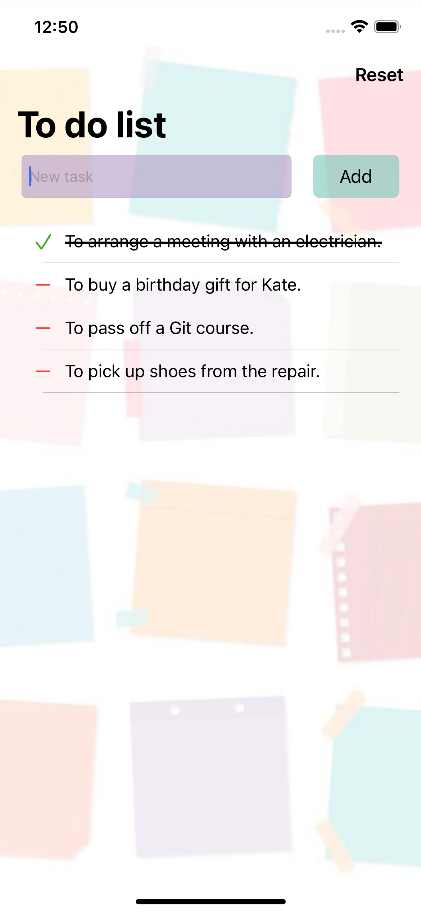
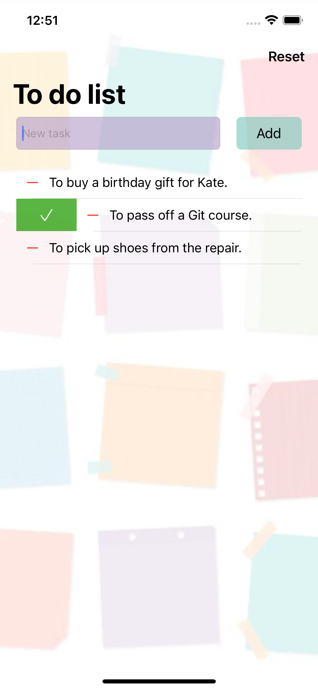
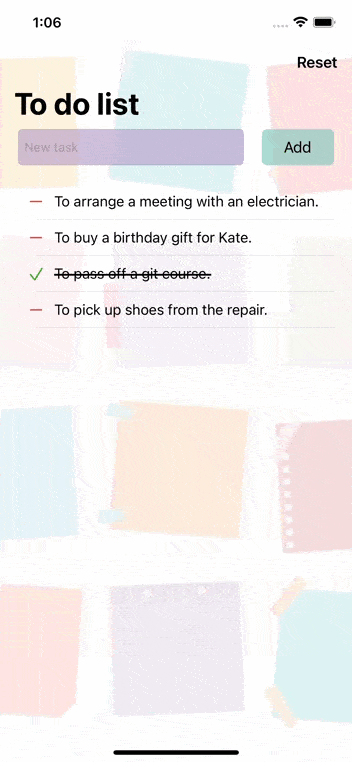

# TODO - an app for tasks tracking
An easy way to keep a To Do list.

## Table of Contents
* [Introduction](#introduction)
* [Requirements](#requirements)
* [Installation](#installation)
* [Technologies](#technologies)
* [Features](#features)
* [Contacts](#contacts)

## Introduction
**ToDo** is an application, which allows to track all important tasks by keeping a To do list.  
  
 | 
:------------------------: | :-------------------------:

## Requirements
* Xcode 13.0 or later
* iOS 15.0 or later

## Installation
1. Clone the repository:  
   * using HTTPS:  
`$ git clone https://github.com/milaplatonova/ToDo.git`
    * using SSH:  
`$ git clone git@github.com:milaplatonova/ToDo.git`
1. Open the project in Xcode:  
`$ open ToDo.xcodeproj`
1. Choose the **iOS Simulator**, Build and Run the project.

## Technologies
**TableView**  
To display tasks is used a TableView with leading and trailing swipe actions for cells.  
  
**NSAttributedString**  
Performed tasks are ~~striked through~~.  
  
**SizeClasses**  
Size Classes are used to create adaptable layouts that look great on all sizes and orientations of a device.  
  
**CoreData**  
The app uses CoreData framework to store the info about user's tasks.

## Features
* iPhone and iPad realization
* responsive design
* actions with tasks:  
  :heavy_plus_sign: add a new task  
  :heavy_minus_sign: delete a task  
  :heavy_multiplication_x: delete all tasks  
* cell swipe actions:  
  :arrow_left: right swipe for deleting a task  
  :arrow_right: left swipe for marking a task as performed (or backward)  
  

## Contacts
Lyudmila Platonova  
:email: milaplatonova@icloud.com  
:bust_in_silhouette: [LinkedIn](https://www.linkedin.com/in/lyudmilaplatonova/)
